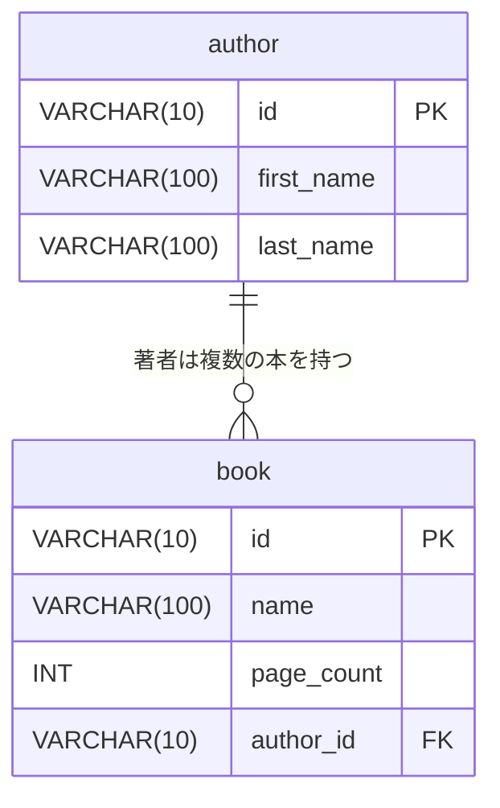

```mermaid
erDiagram
  author ||--o{ book : 著者は複数の本を持つ

  author {
    VARCHAR(10) id PK
    VARCHAR(100) first_name
    VARCHAR(100) last_name
  }

  book {
    VARCHAR(10) id PK
    VARCHAR(100) name
    INT page_count
    VARCHAR(10) author_id FK
  }
```
